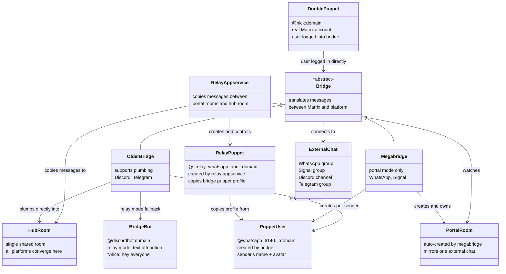
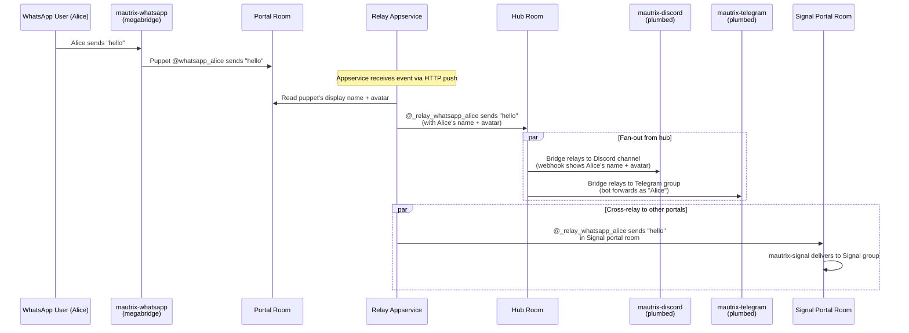
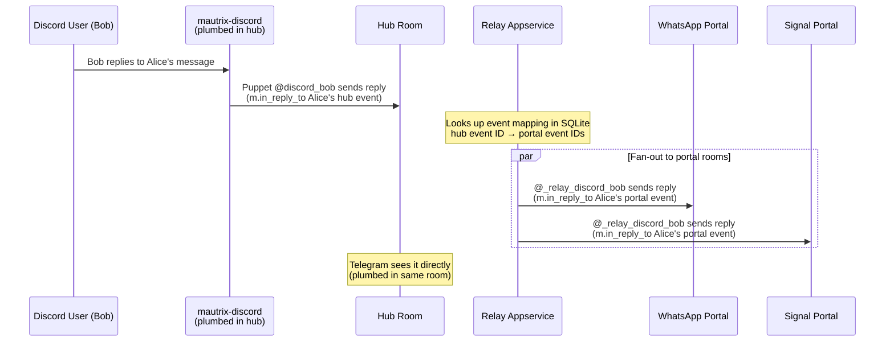

# Matrix Chat Superbridge

Bridges all platforms into a **single Matrix room** so messages flow everywhere.

```
WhatsApp group ──► ┌─────────────────┐ ◄── Discord channel
                   │  Single Matrix  │
Signal group  ──►  │     Room        │ ◄── Telegram group
                   │   (the hub)     │
                   └─────────────────┘
                          ▲
                     Element client
```

## How It Works

Discord and Telegram are **plumbed** directly into the hub room using older mautrix bridges that support it. WhatsApp and Signal use **megabridges** that create their own portal rooms, so a custom **relay appservice** copies messages between the portal rooms and the hub using puppet users.

The result: send a message on any platform, and it appears on all the others with the correct sender name and avatar.

## Architecture

### Class Diagram



### Message Flow: WhatsApp to All Platforms



### Reply Flow: Discord Back to All Platforms



## Glossary

**Bridge** — A service that connects a Matrix room to a chat platform (Discord, Telegram, WhatsApp, Signal). Messages sent on one side are delivered to the other. In this project, all bridges are mautrix bridges maintained by Tulir Asokan, operated as Matrix appservices.

**Relay mode** — The simplest form of message forwarding. A single bridge bot relays messages on behalf of all users, with text attribution like `**Alice (WhatsApp):** hey everyone`. The recipient sees the bot's identity, not the sender's. Enabled per-room with commands like `!discord set-relay` or `!signal set-relay`.

**Puppeting** — The bridge creates a dedicated Matrix user for each external sender (e.g. `@whatsapp_61400000000:domain`), sets their display name and avatar to match the real person, and sends messages *as* that user. To the Matrix room, it looks like the real person is present. The puppet is a persistent identity controlled by the appservice via `IntentAPI`.

**Double puppeting** — When a user has logged into a bridge with their own Matrix account (e.g. `@nick:domain`), messages they send from the bridged platform arrive as their real Matrix identity — not a puppet. This is the highest-fidelity mode: no attribution text, no fake users, just seamless cross-platform presence. The relay bot needs `RELAY_DOUBLE_PUPPETS` config to recognise these users and look up the correct platform-specific name and avatar.

**Appservice** — A Matrix Application Service: a privileged process registered with the homeserver that can create and control users within a reserved namespace (e.g. `@_relay_*:domain`). Both mautrix bridges and the relay bot in this project run as appservices. Registered via `!admin appservices register` in the Continuwuity admin room.

**Plumbing** — Connecting an existing external group chat to an existing Matrix room, so they share the same conversation. Not all bridges support this — mautrix WhatsApp and Signal (megabridges) cannot plumb, which is why this project's relay appservice exists.

**Megabridge** — A newer mautrix bridge architecture where each portal room is created and managed by the bridge automatically. Unlike older bridges, megabridges don't support plumbing into existing rooms — the bridge owns the room. WhatsApp and Signal use this architecture.

**Portal room** — A Matrix room automatically created by a megabridge to mirror a single external chat. The relay appservice watches portal rooms and copies messages into the hub room (and vice versa) using puppet users.

**Hub room** — The single Matrix room where all platforms converge. Discord and Telegram are plumbed directly into it; WhatsApp and Signal portal rooms are connected via the relay appservice. This is the room you'd open in Element to see the full cross-platform conversation.

## Setup

See [CLAUDE.md](CLAUDE.md) for detailed setup, deployment, configuration, and troubleshooting instructions.

See [JOINING.md](JOINING.md) for instructions on joining the chat from each platform.
